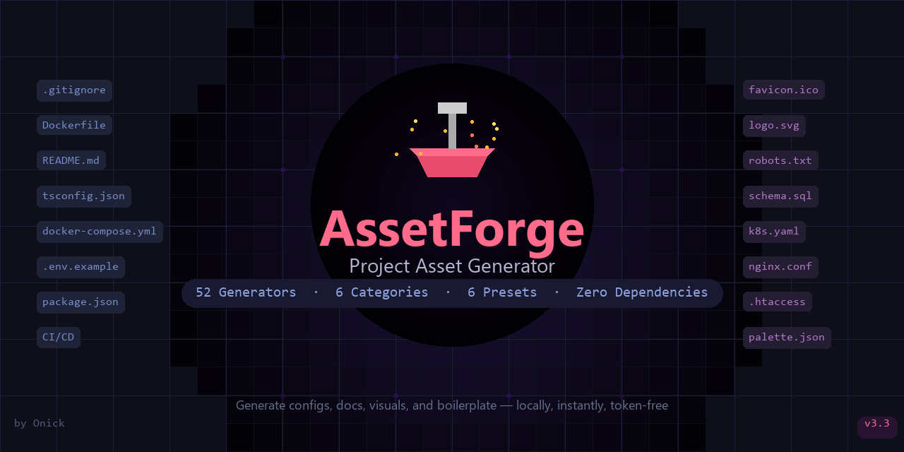

<p align="center">
  
</p>

# 🛠️ AssetForge

**Project Asset Generator — alles was dein Projekt braucht, mit einem Klick.**

AssetForge generiert Boilerplate-Code, Konfigurationsdateien, Dokumentation und visuelle Assets für Software-Projekte. Statt Stunden mit Setup zu verbringen, bekommst du alles in Sekunden.


---

## ✨ Features

### 🎯 6 Generator-Kategorien

| Kategorie | Generatoren |
|-----------|------------|
| **💻 Code** | React Components (TSX/JSX), CSS Modules, Tailwind, Tests, Storybook |
| **⚙️ Config** | .gitignore, Dockerfile, Docker-Compose, .env, CI/CD Pipelines |
| **🗄️ Database** | SQL Schemas, Migrations, Seed Data, ERD Diagramme |
| **📝 Docs** | README, LICENSE, CHANGELOG, CONTRIBUTING |
| **🎨 Visual** | Logos, Favicons, Icons, OG-Images, Farbpaletten |
| **🔒 Security** | robots.txt, security.txt, .htaccess |

### 🚀 Fertige Presets

Ein-Klick-Setup für ganze Projekte:
- **Python Project** — README, License, Gitignore, Dockerfile, .env, CI/CD
- **Node Project** — Komplettes Node.js Setup
- **Fullstack Project** — Frontend + Backend + Docker + DB + Nginx
- **API Backend** — FastAPI/Express mit DB Schema & Security
- **React App** — Vite + TypeScript + ESLint + Tests
- **Static Website** — Vite + Tailwind

### 🎨 Weitere Highlights
- 🔍 **Quick Launcher** (Ctrl+K) — Schnellzugriff auf alle Generatoren
- ⭐ **Favoriten** — Speichere deine häufigsten Konfigurationen
- 📦 **Bundle Builder** — Kombiniere mehrere Generatoren
- 📋 **History** — Alle Generierungen mit Undo-Funktion
- 🌓 **Dark/Light Mode**
- 📥 **ZIP Export** — Alle generierten Dateien als ZIP downloaden

---

## 🚀 Installation

### Voraussetzungen
- Python 3.10 oder höher
- pip

### Setup

```bash
# Repository klonen
git clone https://github.com/spreizel-onick/AssetForge.git
cd AssetForge

# Dependencies installieren
pip install -r requirements.txt

# Starten
python app.py
```

Die App öffnet sich unter **http://localhost:5000**

### Windows
Einfach `start.bat` doppelklicken.

---

## 📸 Verwendung

1. **Generator wählen** — Aus der Sidebar oder per Quick Launcher (Ctrl+K)
2. **Parameter konfigurieren** — Jeder Generator hat eigene Optionen
3. **Generieren** — Klick auf "Generieren"
4. **Ergebnis** — Dateien erscheinen im Output-Browser mit Vorschau
5. **Export** — Einzeln downloaden oder alles als ZIP

---

## 🏗️ Architektur

```
AssetForge/
├── app.py                 # FastAPI Server
├── generators/            # Generator-Module
│   ├── __init__.py       # Registry & Presets
│   ├── code.py           # Code-Generatoren
│   ├── config.py         # Config-Generatoren
│   ├── database.py       # Datenbank-Generatoren
│   ├── docs.py           # Dokumentation
│   ├── visual.py         # Visuelle Assets
│   └── security.py       # Security-Dateien
├── templates/             # Jinja2 Templates
├── static/                # Frontend (HTML/CSS/JS)
├── output/                # Generierte Dateien
└── requirements.txt
```

---

## 🛠️ Tech Stack

- **Backend:** Python, FastAPI, Jinja2, Pillow
- **Frontend:** Vanilla JavaScript, CSS
- **Keine externen Abhängigkeiten** im Frontend — läuft komplett lokal

---

## 📄 License

MIT License — siehe [LICENSE](LICENSE)

---

## 👤 Autor

**Onick**
- GitHub: [@spreizel-onick](https://github.com/spreizel-onick)
- Email: plingoo.app@gmail.com

---

*Made with ❤️ and ☕*
